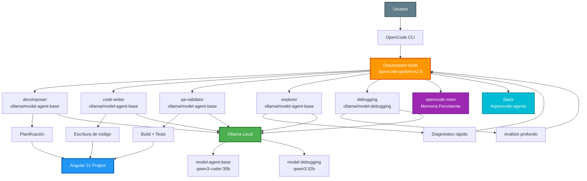

# Arquitectura Final (Iteración 37)

> **Iteración:** 37 de 37  
> **Estado:** Configuración final y más refinada  
> **Stack:** Ollama + OpenCode + Angular 21  
> **Hardware de referencia:** Radeon AI PRO R9700 (32 GB VRAM), AMD Ryzen 9 7900X, 64 GB DDR5

---

## Vista conceptual


*Diagrama generado automáticamente desde fuente Mermaid. Ver sección "Diagrama Mermaid" para el código editable.*

---

## Diagrama Mermaid



> **Nota:** GitHub renderiza Mermaid nativamente. Si estás leyendo esto fuera de GitHub, usa la imagen PNG de la sección anterior.

---

## Diagrama Draw.io (diagrams.net)

Copia el siguiente XML en un archivo `.drawio` y ábrelo en [diagrams.net](https://app.diagrams.net):

```xml
<mxfile host="app.diagrams.net" modified="2026-07-13T12:00:00.000Z" agent="OpenCode" version="22.0.0" etag="etag" type="device">
  <diagram id="arquitectura-final-37" name="Arquitectura Final">
    <mxGraphModel dx="1600" dy="900" grid="1" gridSize="10" guides="1" tooltips="1" connect="1" arrows="1" fold="1" page="1" pageScale="1" pageWidth="1600" pageHeight="900" math="0" shadow="0">
      <root>
        <mxCell id="0" />
        <mxCell id="1" parent="0" />
        
        <!-- Usuario -->
        <mxCell id="usuario" value="Usuario" style="ellipse;whiteSpace=wrap;html=1;fillColor=#607d8b;strokeColor=#37474f;fontColor=#ffffff;" vertex="1" parent="1">
          <mxGeometry x="40" y="360" width="120" height="80" as="geometry" />
        </mxCell>
        
        <!-- OpenCode CLI -->
        <mxCell id="opencode" value="OpenCode CLI" style="rounded=1;whiteSpace=wrap;html=1;fillColor=#90a4ae;strokeColor=#546e7a;fontColor=#ffffff;" vertex="1" parent="1">
          <mxGeometry x="200" y="360" width="140" height="80" as="geometry" />
        </mxCell>
        
        <!-- Orquestador build -->
        <mxCell id="orquestador" value="Orquestador build&lt;br&gt;opencode-go/kimi-k2.6" style="rounded=1;whiteSpace=wrap;html=1;fillColor=#ff9800;strokeColor=#e65100;fontColor=#ffffff;fontStyle=1" vertex="1" parent="1">
          <mxGeometry x="400" y="320" width="200" height="160" as="geometry" />
        </mxCell>
        
        <!-- Subagentes -->
        <mxCell id="decomposer" value="decomposer&lt;br&gt;ollama/model-agent-base" style="rounded=1;whiteSpace=wrap;html=1;fillColor=#42a5f5;strokeColor=#1565c0;fontColor=#ffffff;" vertex="1" parent="1">
          <mxGeometry x="680" y="40" width="160" height="80" as="geometry" />
        </mxCell>
        <mxCell id="code-writer" value="code-writer&lt;br&gt;ollama/model-agent-base" style="rounded=1;whiteSpace=wrap;html=1;fillColor=#42a5f5;strokeColor=#1565c0;fontColor=#ffffff;" vertex="1" parent="1">
          <mxGeometry x="680" y="160" width="160" height="80" as="geometry" />
        </mxCell>
        <mxCell id="qa-validator" value="qa-validator&lt;br&gt;ollama/model-agent-base" style="rounded=1;whiteSpace=wrap;html=1;fillColor=#42a5f5;strokeColor=#1565c0;fontColor=#ffffff;" vertex="1" parent="1">
          <mxGeometry x="680" y="280" width="160" height="80" as="geometry" />
        </mxCell>
        <mxCell id="explorer" value="explorer&lt;br&gt;ollama/model-agent-base" style="rounded=1;whiteSpace=wrap;html=1;fillColor=#42a5f5;strokeColor=#1565c0;fontColor=#ffffff;" vertex="1" parent="1">
          <mxGeometry x="680" y="400" width="160" height="80" as="geometry" />
        </mxCell>
        <mxCell id="debugging" value="debugging&lt;br&gt;ollama/model-debugging" style="rounded=1;whiteSpace=wrap;html=1;fillColor=#ab47bc;strokeColor=#6a1b9a;fontColor=#ffffff;" vertex="1" parent="1">
          <mxGeometry x="680" y="520" width="160" height="80" as="geometry" />
        </mxCell>
        
        <!-- Ollama -->
        <mxCell id="ollama" value="Ollama Local" style="rounded=1;whiteSpace=wrap;html=1;fillColor=#66bb6a;strokeColor=#2e7d32;fontColor=#ffffff;fontStyle=1" vertex="1" parent="1">
          <mxGeometry x="920" y="280" width="160" height="160" as="geometry" />
        </mxCell>
        <mxCell id="model-base" value="model-agent-base&lt;br&gt;qwen3-coder:30b" style="rounded=1;whiteSpace=wrap;html=1;fillColor=#a5d6a7;strokeColor=#2e7d32;fontColor=#000000;" vertex="1" parent="1">
          <mxGeometry x="1120" y="280" width="160" height="70" as="geometry" />
        </mxCell>
        <mxCell id="model-debug" value="model-debugging&lt;br&gt;qwen3:32b" style="rounded=1;whiteSpace=wrap;html=1;fillColor=#a5d6a7;strokeColor=#2e7d32;fontColor=#000000;" vertex="1" parent="1">
          <mxGeometry x="1120" y="370" width="160" height="70" as="geometry" />
        </mxCell>
        
        <!-- Integraciones -->
        <mxCell id="memoria" value="opencode-mem&lt;br&gt;Memoria Persistente" style="rounded=1;whiteSpace=wrap;html=1;fillColor=#ce93d8;strokeColor=#6a1b9a;fontColor=#ffffff;" vertex="1" parent="1">
          <mxGeometry x="400" y="560" width="200" height="80" as="geometry" />
        </mxCell>
        <mxCell id="slack" value="Slack&lt;br&gt;#opencode-agents" style="rounded=1;whiteSpace=wrap;html=1;fillColor=#80deea;strokeColor=#00838f;fontColor=#000000;" vertex="1" parent="1">
          <mxGeometry x="400" y="680" width="200" height="80" as="geometry" />
        </mxCell>
        
        <!-- Output -->
        <mxCell id="output" value="Angular 21 Project&lt;br&gt;Vitest + Playwright + Signals" style="rounded=1;whiteSpace=wrap;html=1;fillColor=#2196f3;strokeColor=#1565c0;fontColor=#ffffff;fontStyle=1" vertex="1" parent="1">
          <mxGeometry x="920" y="80" width="200" height="100" as="geometry" />
        </mxCell>
        
        <!-- Conexiones -->
        <mxCell id="c1" style="edgeStyle=orthogonalEdgeStyle;rounded=0;orthogonalLoop=1;jettySize=auto;html=1;exitX=1;exitY=0.5;exitDx=0;exitDy=0;entryX=0;entryY=0.5;entryDx=0;entryDy=0;" edge="1" parent="1" source="usuario" target="opencode">
          <mxGeometry relative="1" as="geometry" />
        </mxCell>
        <mxCell id="c2" style="edgeStyle=orthogonalEdgeStyle;rounded=0;orthogonalLoop=1;jettySize=auto;html=1;exitX=1;exitY=0.5;exitDx=0;exitDy=0;entryX=0;entryY=0.5;entryDx=0;entryDy=0;" edge="1" parent="1" source="opencode" target="orquestador">
          <mxGeometry relative="1" as="geometry" />
        </mxCell>
        <mxCell id="c3" style="edgeStyle=orthogonalEdgeStyle;rounded=0;orthogonalLoop=1;jettySize=auto;html=1;exitX=1;exitY=0.5;exitDx=0;exitDy=0;entryX=0;entryY=0.5;entryDx=0;entryDy=0;" edge="1" parent="1" source="orquestador" target="decomposer">
          <mxGeometry relative="1" as="geometry" />
        </mxCell>
        <mxCell id="c4" style="edgeStyle=orthogonalEdgeStyle;rounded=0;orthogonalLoop=1;jettySize=auto;html=1;exitX=1;exitY=0.5;exitDx=0;exitDy=0;entryX=0;entryY=0.5;entryDx=0;entryDy=0;" edge="1" parent="1" source="orquestador" target="code-writer">
          <mxGeometry relative="1" as="geometry" />
        </mxCell>
        <mxCell id="c5" style="edgeStyle=orthogonalEdgeStyle;rounded=0;orthogonalLoop=1;jettySize=auto;html=1;exitX=1;exitY=0.5;exitDx=0;exitDy=0;entryX=0;entryY=0.5;entryDx=0;entryDy=0;" edge="1" parent="1" source="orquestador" target="qa-validator">
          <mxGeometry relative="1" as="geometry" />
        </mxCell>
        <mxCell id="c6" style="edgeStyle=orthogonalEdgeStyle;rounded=0;orthogonalLoop=1;jettySize=auto;html=1;exitX=1;exitY=0.5;exitDx=0;exitDy=0;entryX=0;entryY=0.5;entryDx=0;entryDy=0;" edge="1" parent="1" source="orquestador" target="explorer">
          <mxGeometry relative="1" as="geometry" />
        </mxCell>
        <mxCell id="c7" style="edgeStyle=orthogonalEdgeStyle;rounded=0;orthogonalLoop=1;jettySize=auto;html=1;exitX=1;exitY=0.5;exitDx=0;exitDy=0;entryX=0;entryY=0.5;entryDx=0;entryDy=0;" edge="1" parent="1" source="orquestador" target="debugging">
          <mxGeometry relative="1" as="geometry" />
        </mxCell>
        <mxCell id="c8" style="edgeStyle=orthogonalEdgeStyle;rounded=0;orthogonalLoop=1;jettySize=auto;html=1;exitX=1;exitY=0.5;exitDx=0;exitDy=0;entryX=0;entryY=0.25;entryDx=0;entryDy=0;" edge="1" parent="1" source="decomposer" target="output">
          <mxGeometry relative="1" as="geometry" />
        </mxCell>
        <mxCell id="c9" style="edgeStyle=orthogonalEdgeStyle;rounded=0;orthogonalLoop=1;jettySize=auto;html=1;exitX=1;exitY=0.5;exitDx=0;exitDy=0;entryX=0;entryY=0.5;entryDx=0;entryDy=0;" edge="1" parent="1" source="code-writer" target="output">
          <mxGeometry relative="1" as="geometry" />
        </mxCell>
        <mxCell id="c10" style="edgeStyle=orthogonalEdgeStyle;rounded=0;orthogonalLoop=1;jettySize=auto;html=1;exitX=1;exitY=0.5;exitDx=0;exitDy=0;entryX=0;entryY=0.75;entryDx=0;entryDy=0;" edge="1" parent="1" source="qa-validator" target="output">
          <mxGeometry relative="1" as="geometry" />
        </mxCell>
        <mxCell id="c11" style="edgeStyle=orthogonalEdgeStyle;rounded=0;orthogonalLoop=1;jettySize=auto;html=1;exitX=1;exitY=0.5;exitDx=0;exitDy=0;entryX=0;entryY=0.3;entryDx=0;entryDy=0;" edge="1" parent="1" source="decomposer" target="ollama">
          <mxGeometry relative="1" as="geometry" />
        </mxCell>
        <mxCell id="c12" style="edgeStyle=orthogonalEdgeStyle;rounded=0;orthogonalLoop=1;jettySize=auto;html=1;exitX=1;exitY=0.5;exitDx=0;exitDy=0;entryX=0;entryY=0.45;entryDx=0;entryDy=0;" edge="1" parent="1" source="code-writer" target="ollama">
          <mxGeometry relative="1" as="geometry" />
        </mxCell>
        <mxCell id="c13" style="edgeStyle=orthogonalEdgeStyle;rounded=0;orthogonalLoop=1;jettySize=auto;html=1;exitX=1;exitY=0.5;exitDx=0;exitDy=0;entryX=0;entryY=0.6;entryDx=0;entryDy=0;" edge="1" parent="1" source="qa-validator" target="ollama">
          <mxGeometry relative="1" as="geometry" />
        </mxCell>
        <mxCell id="c14" style="edgeStyle=orthogonalEdgeStyle;rounded=0;orthogonalLoop=1;jettySize=auto;html=1;exitX=1;exitY=0.5;exitDx=0;exitDy=0;entryX=0;entryY=0.75;entryDx=0;entryDy=0;" edge="1" parent="1" source="explorer" target="ollama">
          <mxGeometry relative="1" as="geometry" />
        </mxCell>
        <mxCell id="c15" style="edgeStyle=orthogonalEdgeStyle;rounded=0;orthogonalLoop=1;jettySize=auto;html=1;exitX=1;exitY=0.5;exitDx=0;exitDy=0;entryX=0;entryY=0.9;entryDx=0;entryDy=0;" edge="1" parent="1" source="debugging" target="ollama">
          <mxGeometry relative="1" as="geometry" />
        </mxCell>
        <mxCell id="c16" style="edgeStyle=orthogonalEdgeStyle;rounded=0;orthogonalLoop=1;jettySize=auto;html=1;exitX=0.5;exitY=1;exitDx=0;exitDy=0;entryX=0.5;entryY=0;entryDx=0;entryDy=0;" edge="1" parent="1" source="orquestador" target="memoria">
          <mxGeometry relative="1" as="geometry" />
        </mxCell>
        <mxCell id="c17" style="edgeStyle=orthogonalEdgeStyle;rounded=0;orthogonalLoop=1;jettySize=auto;html=1;exitX=0.5;exitY=1;exitDx=0;exitDy=0;entryX=0.5;entryY=0;entryDx=0;entryDy=0;" edge="1" parent="1" source="memoria" target="slack">
          <mxGeometry relative="1" as="geometry" />
        </mxCell>
        <mxCell id="c18" style="edgeStyle=orthogonalEdgeStyle;rounded=0;orthogonalLoop=1;jettySize=auto;html=1;exitX=1;exitY=0.5;exitDx=0;exitDy=0;entryX=0;entryY=0.5;entryDx=0;entryDy=0;" edge="1" parent="1" source="ollama" target="model-base">
          <mxGeometry relative="1" as="geometry" />
        </mxCell>
        <mxCell id="c19" style="edgeStyle=orthogonalEdgeStyle;rounded=0;orthogonalLoop=1;jettySize=auto;html=1;exitX=1;exitY=0.5;exitDx=0;exitDy=0;entryX=0;entryY=0.5;entryDx=0;entryDy=0;" edge="1" parent="1" source="ollama" target="model-debug">
          <mxGeometry relative="1" as="geometry" />
        </mxCell>
      </root>
    </mxGraphModel>
  </diagram>
</mxfile>
```

> **Cómo usar:** Guarda el XML anterior en un archivo llamado `arquitectura.drawio` y ábrelo en [diagrams.net](https://app.diagrams.net) (arrastra o usa Archivo > Abrir desde > Dispositivo).

---

## Diagrama Excalidraw

Copia el siguiente JSON y pégalo en [Excalidraw](https://excalidraw.com) (Menú > Abrir > Pegar desde portapapeles):

```json
{
  "type": "excalidraw",
  "version": 2,
  "source": "OpenCode",
  "elements": [
    {
      "id": "usuario",
      "type": "ellipse",
      "x": 100,
      "y": 300,
      "width": 120,
      "height": 80,
      "backgroundColor": "#607d8b",
      "strokeColor": "#37474f",
      "fillStyle": "solid",
      "strokeWidth": 2,
      "roundness": { "type": 2 },
      "seed": 1,
      "version": 1,
      "versionNonce": 1,
      "isDeleted": false,
      "boundElements": [{ "type": "text", "id": "text-usuario" }],
      "updated": 1,
      "link": null,
      "locked": false
    },
    {
      "id": "text-usuario",
      "type": "text",
      "x": 130,
      "y": 325,
      "width": 60,
      "height": 30,
      "text": "Usuario",
      "fontSize": 16,
      "fontFamily": 1,
      "textAlign": "center",
      "verticalAlign": "middle",
      "baseline": 22,
      "backgroundColor": "transparent",
      "fillStyle": "solid",
      "strokeColor": "#ffffff",
      "strokeWidth": 1,
      "seed": 2,
      "version": 1,
      "versionNonce": 2,
      "isDeleted": false,
      "boundElements": null,
      "updated": 1,
      "link": null,
      "locked": false
    },
    {
      "id": "orquestador",
      "type": "rectangle",
      "x": 400,
      "y": 250,
      "width": 220,
      "height": 180,
      "backgroundColor": "#ff9800",
      "strokeColor": "#e65100",
      "fillStyle": "solid",
      "strokeWidth": 3,
      "roundness": { "type": 3, "value": 8 },
      "seed": 3,
      "version": 1,
      "versionNonce": 3,
      "isDeleted": false,
      "boundElements": [{ "type": "text", "id": "text-orquestador" }],
      "updated": 1,
      "link": null,
      "locked": false
    },
    {
      "id": "text-orquestador",
      "type": "text",
      "x": 420,
      "y": 305,
      "width": 180,
      "height": 70,
      "text": "Orquestador build\nopencode-go/kimi-k2.6",
      "fontSize": 16,
      "fontFamily": 1,
      "textAlign": "center",
      "verticalAlign": "middle",
      "baseline": 22,
      "backgroundColor": "transparent",
      "fillStyle": "solid",
      "strokeColor": "#ffffff",
      "strokeWidth": 1,
      "seed": 4,
      "version": 1,
      "versionNonce": 4,
      "isDeleted": false,
      "boundElements": null,
      "updated": 1,
      "link": null,
      "locked": false
    },
    {
      "id": "code-writer",
      "type": "rectangle",
      "x": 700,
      "y": 160,
      "width": 180,
      "height": 80,
      "backgroundColor": "#42a5f5",
      "strokeColor": "#1565c0",
      "fillStyle": "solid",
      "strokeWidth": 2,
      "roundness": { "type": 3, "value": 8 },
      "seed": 5,
      "version": 1,
      "versionNonce": 5,
      "isDeleted": false,
      "boundElements": [{ "type": "text", "id": "text-cw" }],
      "updated": 1,
      "link": null,
      "locked": false
    },
    {
      "id": "text-cw",
      "type": "text",
      "x": 720,
      "y": 180,
      "width": 140,
      "height": 40,
      "text": "code-writer\nmodel-agent-base",
      "fontSize": 14,
      "fontFamily": 1,
      "textAlign": "center",
      "verticalAlign": "middle",
      "baseline": 19,
      "backgroundColor": "transparent",
      "fillStyle": "solid",
      "strokeColor": "#ffffff",
      "strokeWidth": 1,
      "seed": 6,
      "version": 1,
      "versionNonce": 6,
      "isDeleted": false,
      "boundElements": null,
      "updated": 1,
      "link": null,
      "locked": false
    },
    {
      "id": "ollama",
      "type": "rectangle",
      "x": 960,
      "y": 260,
      "width": 180,
      "height": 160,
      "backgroundColor": "#66bb6a",
      "strokeColor": "#2e7d32",
      "fillStyle": "solid",
      "strokeWidth": 3,
      "roundness": { "type": 3, "value": 8 },
      "seed": 7,
      "version": 1,
      "versionNonce": 7,
      "isDeleted": false,
      "boundElements": [{ "type": "text", "id": "text-ollama" }],
      "updated": 1,
      "link": null,
      "locked": false
    },
    {
      "id": "text-ollama",
      "type": "text",
      "x": 990,
      "y": 325,
      "width": 120,
      "height": 30,
      "text": "Ollama Local",
      "fontSize": 16,
      "fontFamily": 1,
      "textAlign": "center",
      "verticalAlign": "middle",
      "baseline": 22,
      "backgroundColor": "transparent",
      "fillStyle": "solid",
      "strokeColor": "#ffffff",
      "strokeWidth": 1,
      "seed": 8,
      "version": 1,
      "versionNonce": 8,
      "isDeleted": false,
      "boundElements": null,
      "updated": 1,
      "link": null,
      "locked": false
    },
    {
      "id": "output",
      "type": "rectangle",
      "x": 960,
      "y": 40,
      "width": 200,
      "height": 100,
      "backgroundColor": "#2196f3",
      "strokeColor": "#1565c0",
      "fillStyle": "solid",
      "strokeWidth": 3,
      "roundness": { "type": 3, "value": 8 },
      "seed": 9,
      "version": 1,
      "versionNonce": 9,
      "isDeleted": false,
      "boundElements": [{ "type": "text", "id": "text-output" }],
      "updated": 1,
      "link": null,
      "locked": false
    },
    {
      "id": "text-output",
      "type": "text",
      "x": 980,
      "y": 65,
      "width": 160,
      "height": 50,
      "text": "Angular 21 Project\nVitest + Playwright",
      "fontSize": 14,
      "fontFamily": 1,
      "textAlign": "center",
      "verticalAlign": "middle",
      "baseline": 19,
      "backgroundColor": "transparent",
      "fillStyle": "solid",
      "strokeColor": "#ffffff",
      "strokeWidth": 1,
      "seed": 10,
      "version": 1,
      "versionNonce": 10,
      "isDeleted": false,
      "boundElements": null,
      "updated": 1,
      "link": null,
      "locked": false
    },
    {
      "id": "memoria",
      "type": "rectangle",
      "x": 400,
      "y": 500,
      "width": 220,
      "height": 80,
      "backgroundColor": "#ce93d8",
      "strokeColor": "#6a1b9a",
      "fillStyle": "solid",
      "strokeWidth": 2,
      "roundness": { "type": 3, "value": 8 },
      "seed": 11,
      "version": 1,
      "versionNonce": 11,
      "isDeleted": false,
      "boundElements": [{ "type": "text", "id": "text-memoria" }],
      "updated": 1,
      "link": null,
      "locked": false
    },
    {
      "id": "text-memoria",
      "type": "text",
      "x": 430,
      "y": 520,
      "width": 160,
      "height": 40,
      "text": "opencode-mem\nMemoria Persistente",
      "fontSize": 14,
      "fontFamily": 1,
      "textAlign": "center",
      "verticalAlign": "middle",
      "baseline": 19,
      "backgroundColor": "transparent",
      "fillStyle": "solid",
      "strokeColor": "#ffffff",
      "strokeWidth": 1,
      "seed": 12,
      "version": 1,
      "versionNonce": 12,
      "isDeleted": false,
      "boundElements": null,
      "updated": 1,
      "link": null,
      "locked": false
    }
  ],
  "appState": {
    "gridSize": 20,
    "viewBackgroundColor": "#ffffff"
  },
  "files": {}
}
```

> **Cómo usar:** Ve a [excalidraw.com](https://excalidraw.com), haz clic en el menú (☰) > Abrir > Pega el contenido del portapapeles. Pega el JSON completo de arriba.

---

## Componentes detallados

### 1. Orquestador principal (`build`)

| Atributo | Valor |
|----------|-------|
| **Modelo** | `opencode-go/kimi-k2.6` (cloud) |
| **Rol** | Punto de entrada único. No edita código, no ejecuta bash, no lee archivos. |
| **Herramientas** | `task()`, `memory()`, `slack_send_slack_message` |
| **Responsabilidades** | Delegación, planificación de alto nivel, gestión de memoria persistente, notificaciones Slack |

### 2. Planificador (`decomposer`)

| Atributo | Valor |
|----------|-------|
| **Modelo** | `ollama/model-agent-base` (qwen3-coder:30b, 65K ctx) |
| **Rol** | Investiga la estructura real del proyecto en disco y desglosa objetivos en tareas secuenciales |
| **Herramientas** | `read`, `glob`, `skill` |
| **Skills clave** | `angular-patterns`, `node-setup` |

### 3. Escritor de código (`code-writer`)

| Atributo | Valor |
|----------|-------|
| **Modelo** | `ollama/model-agent-base` (qwen3-coder:30b, 65K ctx) |
| **Rol** | Escribe y modifica archivos. Puede ejecutar `npm run build/test` para verificar compilación. |
| **Prohibiciones** | NO crea tests (`*.spec.ts`). NO paraleliza con dependencias compartidas. NO crea stubs. |
| **Límites** | Máx 8 toolcalls por tarea. Máx 3 archivos por task. Máx 2 reescrituras del mismo archivo. |
| **Skills clave** | `angular-patterns` (obligatorio toolcall #1), `node-setup`, `ui-design-system` |

### 4. QA y Testing (`qa-validator`)

| Atributo | Valor |
|----------|-------|
| **Modelo** | `ollama/model-agent-base` (qwen3-coder:30b, 65K ctx) |
| **Rol** | Build, tests unitarios, tests E2E. Crea/corrige `*.spec.ts` y `*.e2e.spec.ts`. |
| **Prohibiciones** | NO modifica archivos de implementación. Solo specs. |
| **Herramientas** | `edit` (solo specs), `bash` (npm, npx, playwright) |
| **Skills clave** | `angular-patterns`, `node-setup` |

### 5. Explorador rápido (`explorer`)

| Atributo | Valor |
|----------|-------|
| **Modelo** | `ollama/model-agent-base` (qwen3-coder:30b, 65K ctx) |
| **Rol** | Búsquedas y diagnóstico RÁPIDO. Solo lectura, sin razonamiento profundo. |
| **Límites** | Máx 10 toolcalls. Extrae fragmentos clave, NO incluye contenido completo de archivos. |
| **Herramientas** | `read`, `glob`, `grep`, `bash` (solo lectura: ls, cat, find, wc) |

### 6. Depurador profundo (`debugging`)

| Atributo | Valor |
|----------|-------|
| **Modelo** | `ollama/model-debugging` (qwen3:32b, 32K ctx) |
| **Rol** | Análisis de causa raíz de bugs COMPLEJOS. Solo lectura + razonamiento. NO edita. |
| **Herramientas** | `read`, `glob`, `grep`, `skill` (`angular-patterns`) |
| **Prohibiciones** | `edit`, `bash`, `task`, `webfetch`, `websearch` |

### 7. Motor local (`Ollama`)

| Modelo | Base | Contexto | Temperatura | Uso |
|--------|------|----------|-------------|-----|
| `model-agent-base` | qwen3-coder:30b | 65.536 tokens | 0 | Subagentes de código, diagnóstico rápido |
| `model-debugging` | qwen3:32b | 32.768 tokens | 0 | Análisis profundo de bugs |

### 8. Memoria persistente (`opencode-mem`)

- **Plugin:** Captura automática de contexto con `qwen3:8b`
- **Tool nativa:** `memory({ mode: "search", query: "..." })`
- **Inyección automática:** Hasta 3 memorias relevantes por sesión
- **Web UI:** `http://127.0.0.1:4747`

### 9. Notificaciones (`Slack`)

Canal `#opencode-agents`. Notificaciones en 3 momentos:
1. 📨 Al recibir prompt del usuario
2. ⚠️ Antes de acciones que requieren permiso
3. ✅ Al completar todas las fases

---

## Flujo de datos

```
Entrada: Prompt coloquial del usuario
        │
        ▼
┌─────────────────┐
│   Orquestador   │──► memory.search() ¿contexto histórico relevante?
│  (kimi-k2.6)    │──► slack_send_slack_message("📨 Nuevo prompt")
└────────┬────────┘
         │
    FASE 1: SCAFFOLDING
         ├──► code-writer: ng new → npm run build → ng test
         ├──► explorer: verificación rápida (¿existe src/app/?)
         │
    FASE 2: PLANIFICACIÓN
         ├──► decomposer: investiga disco + desglosa en plan
         │     (Build confía en el plan. No lo verifica.)
         │
    FASE 3: EJECUCIÓN
         ├──► code-writer: paso N
         ├──► [BUILD: qa-validator verifica]
         ├──► ... (repite hasta completar plan)
         │
    FINAL: qa-validator crea tests + ejecuta suite E2E
         │
         ├──► slack_send_slack_message("✅ Completado")
         ▼
Salida: Proyecto Angular 21 funcional + tests pasando
```

---

## Decisiones arquitectónicas clave (ADR)

### ADR-001: Orquestador online + subagentes locales

**Contexto:** Los modelos locales de 30B+ parámetros son capaces de escribir código y tests de alta calidad, pero su razonamiento de planificación de alto nivel es inferior a modelos cloud de 1T+ parámetros.

**Decisión:** Usar `kimi-k2.6` (cloud) como orquestador y `qwen3-coder:30b` / `qwen3:32b` (local) para trabajo pesado.

**Consecuencias:**
- ✅ Reduce costos de API en ~80% (solo 1 agente cloud vs. 6-10 en configuraciones anteriores)
- ✅ Mantiene calidad de planificación
- ⚠️ Requiere conexión a internet para el orquestador
- ⚠️ Latencia de red en la fase de planificación

### ADR-002: Máximo 6 agentes

**Contexto:** Configuraciones con 8-10 agentes mostraron variabilidad muy alta y saturación de VRAM.

**Decisión:** Consolidar en 6 roles: build, decomposer, code-writer, qa-validator, explorer, debugging.

**Consecuencias:**
- ✅ Estabilidad de resultados
- ✅ VRAM estable en 32 GB
- ⚠️ Menos paralelismo que configuraciones con 10 agentes

### ADR-003: 3 skills esenciales

**Contexto:** Configuraciones con 26-29 skills eran frágiles y difíciles de depurar.

**Decisión:** Solo `angular-patterns`, `node-setup`, `ui-design-system`.

**Consecuencias:**
- ✅ Fácil de mantener
- ✅ Carga de contexto predecible
- ✅ Reglas Angular 21 centralizadas en un solo lugar
- ⚠️ Si se añade un nuevo framework (Vue, React), requiere nueva skill

### ADR-004: Diagnóstico en 2 niveles

**Contexto:** Un solo agente de diagnóstico era lento para errores simples y superficial para errores complejos.

**Decisión:** `explorer` (rápido, barato, sin razonamiento) para errores simples; `debugging` (profundo, costoso, con razonamiento) solo para errores complejos.

**Consecuencias:**
- ✅ 80% de errores se resuelven en < 10 toolcalls
- ✅ Solo el 20% de errores activa el agente de debugging (ahorro de VRAM)

---

## Referencias

- [AGENTS.md de config-37 →](configuraciones/configuracion-37(configuracion-final)/AGENTS.md)
- [Narrativa detallada →](NARRATIVA.md)
- [10 Principales Lecciones Aprendidas →](10%20Principales%20Lecciones%20Aprendidas.md)
- [Hito Iteración 37 →](Hitos%20Arquitectónicos/iteracion-37.md)

---

## Licencia

MIT — Este diagrama y su documentación son parte del repositorio exploratorio.
