# Diagrama de Evolución

> Visualización de la evolución arquitectónica a través de las 37 iteraciones. Cada nodo representa un cambio fundamental en la arquitectura del sistema multi-agente.

---

## Diagrama de evolución (Mermaid)

```mermaid
graph TD
    subgraph "Fase 1: Online"
        I1[Iteración 1<br/>Agente único<br/>8 agentes / 7 skills<br/>Cloud puro]
        I2[Iteración 2-3<br/>Refinamiento online<br/>Especialización temprana]
    end
    
    subgraph "Fase 2: Local"
        I4[Iteración 4<br/>Primer intento local<br/>Ollama 100%]
        I5[Iteración 5-6<br/>Híbrido / Todo local<br/>devstral-small-2]
    end
    
    subgraph "Fase 3: Especialización"
        I7[Iteración 7<br/>Prompts mejorados]
        I8[Iteración 8<br/>Introducción de especialización<br/>qwen3-coder:30b<br/>8 agentes / 10 skills]
        I9[Iteración 9-12<br/>Anti-contradicción<br/>Verificación post-implementación<br/>Orquestador local]
    end
    
    subgraph "Fase 4: Integración"
        I13[Iteración 13<br/>MySQL + Slack<br/>9 agentes / 22 skills]
        I14[Iteración 14<br/>Explosión multi-agente<br/>10 agentes / 24 skills]
    end
    
    subgraph "Fase 5: Optimización"
        I15[Iteración 15<br/>Separación de investigación<br/>Prompts optimizados<br/>10 agentes / 26 skills]
        I16[Iteración 16<br/>Agentes UI + Analyst]
        I17[Iteración 17-18<br/>Orquestador kimi-k2.6<br/>Prompts reforzados]
    end
    
    subgraph "Fase 6: Handoff"
        I19[Iteración 19<br/>Handoff JSON<br/>4 modelos dedicados]
        I22[Iteración 22<br/>QA independiente<br/>UI designer con qwen3:32b]
        I29[Iteración 29<br/>Pico de complejidad<br/>10 agentes / 29 skills<br/>Guardrails]
    end
    
    subgraph "Fase 7: Reinicios"
        I30[Iteración 30<br/>🔄 REINICIO<br/>5 agentes / 8 skills<br/>Abandono handoff]
        I31[Iteración 31<br/>Puntos de control build]
        I32[Iteración 32<br/>🔄 REINICIO<br/>5 agentes / 3 skills<br/>Skills esenciales]
    end
    
    subgraph "Fase 8: Consolidación"
        I33[Iteración 33<br/>Agente debugging dedicado]
        I34[Iteración 34<br/>Memoria persistente]
        I35[Iteración 35<br/>Permisos QA ampliados]
        I36[Iteración 36<br/>Slack orquestación]
    end
    
    subgraph "Fase 9: Final"
        I37[Iteración 37<br/>✅ Arquitectura actual<br/>6 agentes / 5 skills<br/>Configuración final]
    end
    
    I1 --> I2 --> I4 --> I5 --> I7 --> I8 --> I9 --> I13 --> I14 --> I15 --> I16 --> I17 --> I19 --> I22 --> I29
    I29 --> I30 --> I31 --> I32 --> I33 --> I34 --> I35 --> I36 --> I37
    
    style I1 fill:#e3f2fd,stroke:#1565c0
    style I8 fill:#e8f5e9,stroke:#2e7d32
    style I15 fill:#fff3e0,stroke:#e65100
    style I22 fill:#f3e5f5,stroke:#6a1b9a
    style I29 fill:#ffebee,stroke:#c62828
    style I30 fill:#ffebee,stroke:#c62828,stroke-dasharray: 5 5
    style I32 fill:#ffebee,stroke:#c62828,stroke-dasharray: 5 5
    style I37 fill:#e8f5e9,stroke:#2e7d32,stroke-width:3px
```



---

## Diagrama de evolución (ASCII art)

```
Iteración 1
    │
    ▼
┌─────────────────────────────┐
│  Agente único (cloud puro)  │
│  8 agentes / 7 skills      │
│  OpenRouter + Copilot + Z.AI│
└─────────────────────────────┘
    │
    ▼
Iteración 4
    │
    ▼
┌─────────────────────────────┐
│  Primer intento local       │
│  Ollama 100%                │
│  qwen3-coder:30b            │
└─────────────────────────────┘
    │
    ▼
Iteración 8
    │
    ▼
┌─────────────────────────────┐
│  Introducción de            │
│  especialización            │
│  Roles rígidos + permisos   │
│  8 agentes / 10 skills      │
└─────────────────────────────┘
    │
    ▼
Iteración 14
    │
    ▼
┌─────────────────────────────┐
│  Explosión multi-agente     │
│  10 agentes / 24 skills     │
│  Roles independientes       │
└─────────────────────────────┘
    │
    ▼
Iteración 15
    │
    ▼
┌─────────────────────────────┐
│  Separación de investigación│
│  Prompts optimizados        │
│  UI Designer + Analyst      │
│  10 agentes / 26 skills     │
└─────────────────────────────┘
    │
    ▼
Iteración 17
    │
    ▼
┌─────────────────────────────┐
│  Orquestador + especialistas│
│  Orquestador: kimi-k2.6     │
│  Subagentes: locales          │
│  Transición a híbrido       │
└─────────────────────────────┘
    │
    ▼
Iteración 19
    │
    ▼
┌─────────────────────────────┐
│  Handoff JSON               │
│  Delegación vía archivos    │
│  4 modelos dedicados por rol│
└─────────────────────────────┘
    │
    ▼
Iteración 22
    │
    ▼
┌─────────────────────────────┐
│  QA independiente           │
│  Modelos dedicados          │
│  ui-designer con qwen3:32b  │
└─────────────────────────────┘
    │
    ▼
Iteración 29
    │
    ▼
┌─────────────────────────────┐
│  Pico de complejidad ⚠️      │
│  10 agentes / 29 skills      │
│  Guardrails de seguridad    │
│  Handoffs ignorados         │
└─────────────────────────────┘
    │
    ▼
Iteración 30
    │
    ▼
┌─────────────────────────────┐
│  🔄 REINICIO                │
│  10→5 agentes               │
│  29→8 skills                │
│  Abandono del handoff       │
└─────────────────────────────┘
    │
    ▼
Iteración 32
    │
    ▼
┌─────────────────────────────┐
│  🔄 REINICIO                │
│  5 agentes / 3 skills        │
│  Solo skills esenciales     │
│  Context7 eliminado         │
└─────────────────────────────┘
    │
    ▼
Iteración 33
    │
    ▼
┌─────────────────────────────┐
│  Subagentes especializados  │
│  debugging dedicado         │
│  model-debugging (qwen3:32b)│
└─────────────────────────────┘
    │
    ▼
Iteración 34
    │
    ▼
┌─────────────────────────────┐
│  Memoria persistente        │
│  opencode-mem               │
│  Captura automática         │
└─────────────────────────────┘
    │
    ▼
Iteración 37
    │
    ▼
┌─────────────────────────────┐
│  ✅ Arquitectura actual      │
│  6 agentes / 5 skills        │
│  Híbrida optimizada         │
│  Memoria + Slack + Tests    │
└─────────────────────────────┘
```

---

## Curva de complejidad

```
Complejidad (agentes × skills)
    │
 30 ┤                           ╭─╮
    │                         ╭─╯ │ config-29 (pico)
 25 ┤                       ╭─╯   │
    │                     ╭─╯     │
 20 ┤                   ╭─╯       │
    │                 ╭─╯         │
 15 ┤               ╭─╯           │
    │             ╭─╯             │
 10 ┤    ╭────╭─╯               │
    │  ╭─╯    ╯                   │
  5 ┤╭─╯                          ╰──────╮
    │╯ config-1    config-14    config-30  config-37
  0 ┼────┬────┬────┬────┬────┬────┬────┬────
    1    5   10   15   20   25   30   35   37
                        Iteración
```

### Análisis de la curva

| Fase | Iteraciones | Agentes | Skills | Tendencia |
|------|-------------|---------|--------|-----------|
| **Online** | 1-3 | 8 | 7-9 | Estable, baja complejidad |
| **Local puro** | 4-6 | 8 | 9-12 | Crecimiento por necesidad de protocolos |
| **Especialización** | 7-12 | 8 | 10-17 | Crecimiento controlado |
| **Integración** | 13-14 | 9-10 | 22-24 | Explosión de complejidad |
| **Optimización** | 15-18 | 10 | 26-28 | Máxima complejidad, máxima variabilidad |
| **Handoff** | 19-29 | 10 | 28-29 | Pico insostenible |
| **Reinicio 1** | 30 | 5 | 8 | Colapso y simplificación radical |
| **Reinicio 2** | 32 | 5 | 3 | Mínima complejidad viable |
| **Consolidación** | 33-36 | 5-6 | 3-5 | Refinamiento sobre base simple |
| **Final** | 37 | 6 | 5 | Equilibrio óptimo |

---

## Ciclo de complejidad observado

Este proyecto revela un patrón que parece intrínseco a la ingeniería de sistemas multi-agente:

```
         ┌──────────────┐
         │   Problema    │
         └───────┬───────┘
                 │ Añadir agentes/skills
                 ▼
         ┌──────────────┐
         │ Complejidad  │
         └───────┬───────┘
                 │ Saturación de contexto
                 ▼
         ┌──────────────┐
         │  Saturación  │
         │ Agentes desobedecen │
         └───────┬───────┘
                 │
                 ▼
         ┌──────────────┐
         │  REINICIO 🔄  │
         │ Simplificar   │
         └───────┬───────┘
                 │
                 ▼
         ┌──────────────┐
         │ Estabilización│
         └───────┬───────┘
                 │ Refinamiento
                 ▼
         ┌──────────────┐
         │  Nuevo prob.  │
         └──────────────┘
```

Este ciclo ocurrió **dos veces** en el proyecto:

1. **config-29 → config-30:** 10 agentes/29 skills → 5 agentes/8 skills
2. **config-31 → config-32:** 5 agentes/8 skills → 5 agentes/3 skills

---

## Métricas de evolución

| Iteración | Agentes | Skills | Tipo | Complejidad (A×S) | Estado |
|-----------|---------|--------|------|-------------------|--------|
| 1 | 8 | 7 | Online | 56 | Base |
| 8 | 8 | 10 | Local | 80 | Especialización |
| 14 | 10 | 24 | Local | 240 | Explosión |
| 15 | 10 | 26 | Híbrido | 260 | Pico roles |
| 22 | 10 | 29 | Híbrido | 290 | Handoff |
| 29 | 10 | 29 | Híbrido | 290 | **Pico absoluto** |
| 30 | 5 | 8 | Híbrido | 40 | Reinicio 1 |
| 32 | 5 | 3 | Híbrido | 15 | Reinicio 2 |
| 37 | 6 | 5 | Híbrido | 30 | **Óptimo** |

**Observación:** La complejidad final (30) es ~10x menor que el pico (290), pero produce resultados significativamente mejores. Esto valida la hipótesis de que **menos es más** en sistemas multi-agente locales con recursos de contexto limitados.

---

## Referencias

- [Narrativa detallada →](NARRATIVA.md)
- [10 Principales Lecciones Aprendidas →](10%20Principales%20Lecciones%20Aprendidas.md)
- [Hitos Arquitectónicos →](Hitos%20Arquitectónicos/)

---

## Licencia

MIT
