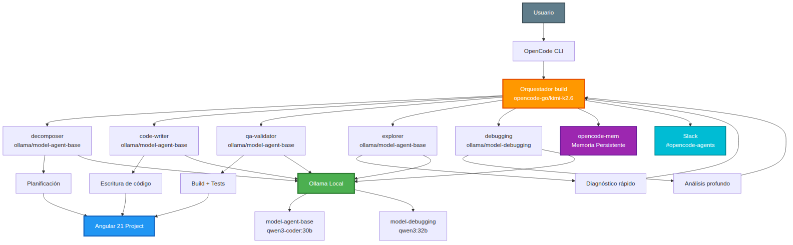

# OpenCode Multiagente Local: 37 Iteraciones de Evolución Arquitectónica

[](LICENSE)
[](https://opencode.ai)
[](.)
[](.)

---

**¿Cansado de pagar APIs cloud en programación multiagentica que gasta tokens como si no hubiera un mañana?** Este repositorio documenta cómo construí un equipo de IA que consta de un agente build online y 6 subagentes locales especializados que orquestan, escriben, testean y depuran código Angular 21 consumiendo una fracción de los tokens promedio para esta clase de proyectos. Lo que lo hace diferente: un orquestador online (kimi-k2.6) coordina subagentes locales (Ollama) con 5 skills exactas, memoria persistente y notificaciones Slack. **37 iteraciones de evolución real, 2 reinicios por saturación, 10 conclusiones empíricas.** Para desarrolladores que quieren agentes de IA propios, auditables y sin facturas sorpresa.

> **Público objetivo:** Developer Workflow Engineers, AI Automation Engineers, Agent Engineering practitioners.

---

## Arquitectura en una imagen



*Diagrama de la arquitectura final (iteración 37): Orquestador online + 5 subagentes locales + Ollama + Memoria persistente + Slack. [Ver diagramas editables →](Arquitectura%20Final%20(Iteración%2037).md)*

---

## Características

- **Arquitectura híbrida inteligente:** Orquestador online + subagentes 100% locales. Reduce costos de API manteniendo calidad de planificación.
- **6 agentes especializados con roles rígidos:** build orquesta, code-writer edita, qa-validator testea, explorer diagnostica rápido, debugging analiza bugs complejos, decomposer planifica.
- **Zero configuraciones cloud para subagentes:** Todo el trabajo pesado corre en Ollama local (qwen3-coder:30b / qwen3:32b).
- **Memoria persistente:** Plugin `opencode-mem` con captura automática de contexto y búsqueda semántica entre sesiones.
- **Skills mínimas, máximo impacto:** Solo 3 skills esenciales (angular-patterns, node-setup, ui-design-system) tras eliminar 26 redundantes.
- **Notificaciones Slack en tiempo real:** El orquestador informa inicio, permisos y resultados en `#opencode-agents`.
- **Anti-saturación por diseño:** Límites de toolcalls, paralelismo controlado (máx 2 tareas), y reglas anti-loop en prompts.
- **Proyecto real generado:** Juego Dinosaur Runner en Angular 21 con Vitest, zoneless, standalone components y 15+ tests E2E.
- **37 snapshots autocontenidos:** Cada carpeta en `configuraciones/configuracion-N/` es un experimento reproducible con su `opencode.json`, `AGENTS.md` y resultado.

---

## Arquitectura

### Orquestador

El agente **build** (`opencode-go/kimi-k2.6`) es el único punto de entrada. No escribe código, no ejecuta bash, no lee archivos. Solo orquesta mediante `task()` a subagentes y gestiona memoria persistente. Delega diagnósticos a `explorer` (errores simples) o `debugging` (errores complejos). Nunca re-verifica: confía en el diagnóstico recibido.

### Subagentes

| Agente | Modelo | Rol | Permisos clave |
|--------|--------|-----|-----------------|
| **build** | `opencode-go/kimi-k2.6` | Orquestador, scaffolding, planificación | `task`, `read`, `glob`, `todowrite` |
| **decomposer** | `ollama/model-agent-base` | Investiga estructura real y desglosa en plan secuencial | `read`, `glob`, `skill` |
| **code-writer** | `ollama/model-agent-base` | Escribe/modifica archivos. Verifica compilación. **NO crea tests.** | `edit`, `bash` (restringido), `skill` |
| **qa-validator** | `ollama/model-agent-base` | Build, tests unitarios, tests E2E. Crea/corrige `*.spec.ts`. | `edit` (solo specs), `bash` (npm/npx), `skill` |
| **explorer** | `ollama/model-agent-base` | Búsquedas y diagnóstico **rápido**. Solo lectura, sin razonamiento. | `read`, `glob`, `bash` (lectura) |
| **debugging** | `ollama/model-debugging` | Análisis de causa raíz de bugs **complejos**. Solo lectura + razonamiento. | `read`, `glob`, `skill` |

### Flujo de trabajo (3 fases)

```
Usuario -> build
  FASE 1 - SCAFFOLDING
    task(code-writer, ng new -> build -> test)
    task(explorer, verificación rápida: ¿existe src/app/?)
    -> pasa a FASE 2

  FASE 2 - PLANIFICACIÓN
    task(decomposer, investiga + planifica)
    Build confía en el plan. No lo verifica.

  FASE 3 - EJECUCIÓN DEL PLAN (paso a paso)
    task(code-writer, ...) -> code-writer verifica compilación
    [BUILD: qa-validator verifica build]
    ...
  FINAL: qa-validator crea tests + ejecuta suite final

DIAGNÓSTICO (solo cuando falla):
  Error simple  -> task(explorer) -> build ajusta
  Error complejo -> task(debugging) -> build recibe diagnóstico -> code-writer corrige
```

### Modelos utilizados

| Modelo | Uso | Contexto | Parámetros clave |
|--------|-----|----------|------------------|
| `opencode-go/kimi-k2.6` | Orquestador build | Cloud | Temperatura 0 |
| `qwen3-coder:30b` (model-agent-base) | Subagentes de código y diagnóstico | Local, 65K contexto | `temperature 0`, `top_k 20`, `top_p 0.8` |
| `qwen3:32b` (model-debugging) | Análisis profundo de bugs | Local, 32K contexto | `temperature 0`, `top_k 20`, `top_p 0.8` |

**Nota:** Los parámetros de contexto se configuran vía **Ollama Modelfiles**, no en `opencode.json`, porque `num_ctx` definido en JSON no siempre era respetado por los modelos.

### Skills del sistema (config-37)

| Skill | Propósito | Cargada por |
|-------|-----------|-------------|
| `angular-patterns` | Reglas Angular 21 (signals, mocks, @if/@for, inject(), tests Vitest) | code-writer (obligatorio toolcall #1), qa-validator, decomposer, debugging |
| `node-setup` | Patrón nvm/source para comandos npm/npx en shell separado | code-writer, qa-validator, decomposer |
| `ui-design-system` | Sistema de diseño Dark Neon para componentes visuales | code-writer (al crear UI) |

### Hardware de referencia

| Componente | Especificación |
|------------|---------------|
| GPU | Radeon AI PRO R9700 Creator (32 GB VRAM) |
| CPU | AMD Ryzen 9 7900X |
| RAM | 64 GB DDR5 |
| SO | POP_OS |

---

## Evolución

### ¿Qué se aprendió?

Este proyecto revela un **ciclo de complejidad intrínseco** a la ingeniería de sistemas multi-agente:

1. **Problema → Añadir complejidad** (más agentes, más skills, más protocolos)
2. **Saturación → Agentes desobedecen** (ignoran prompts, skills, handoffs)
3. **Reinicio → Simplificar drásticamente** (menos agentes, menos skills)
4. **Estabilización → Refinamiento** (ajustes finos sobre base simple)
5. **Nuevo problema → Vuelta al paso 1**

### ¿Por qué hubo 37 iteraciones?

Cada iteración respondía a una hipótesis observable. No era tuning aleatorio: era un proceso de eliminación de variables. El mismo prompt coloquial se ejecutó 37 veces para aislar qué cambios realmente mejoraban la salida y cuáles solo añadían ruido.

- **Fases 1-3 (config 1-6):** Migración de cloud puro a local puro, probando modelos (devstral, qwen3-coder).
- **Fases 4-6 (config 7-18):** Refinamiento de prompts, especialización de roles, transición a orquestador híbrido.
- **Fase 7-8 (config 19-29):** Experimento **handoff JSON** (11 iteraciones). Los agentes ignoraban los archivos de delegación. Añadieron complejidad sin beneficio claro.
- **Fase 9 (config 30-37):** Dos reinicios forzados por saturación de contexto. De 10 agentes/29 skills a **6 agentes/5 skills**.

### Principales cambios

| Reinicio | De | A | Causa raíz |
|----------|----|---|------------|
| **config-30** | 10 agentes / 29 skills | 5 agentes / 8 skills | Handoff JSON ignorado por saturación de contexto. Los agentes locales perdían el hilo de instrucciones con demasiados skills cargadas. |
| **config-32** | 5 agentes / 8 skills | 5 agentes / 3 skills | Skills redundantes y Context7 sin impacto medible. Se consolidó el principio: **skills antes que agentes nuevos**. |

**Hallazgos críticos:**

- **Contexto es el recurso más escaso:** Un agente local saturado ignora instrucciones.
- **Más agentes → más variabilidad:** La correlación es directa. 10 agentes generaban caos; 6 agentes generan estabilidad.
- **Skills > Agentes:** Es mejor añadir una skill a un agente existente que crear un agente nuevo para una tarea.
- **Límites en prompt > skills anti-loop:** Es más efectivo poner "máx 8 toolcalls" en el prompt que una skill genérica de anti-loop.
- **Delegación entre subagentes es riesgosa:** Cuando qa-validator delegaba a code-writer, se generaban bucles que saturaban 32 GB de VRAM.
- **Handoffs:** Funcionaron tras ajustar prompts, pero no se comprobó que redujeran tokens de API. Queda como pregunta abierta para experimentos controlados.
- **Context7 no aportó valor para Angular 21.** Probablemente porque su documentación no está actualizada.

---

## Casos de Uso

### Desarrollo de software
Generar proyectos completos desde un prompt coloquial. En este repositorio: un juego Dinosaur Runner en Angular 21 con pantallas de bienvenida, juego, game over, servicios de puntuación y localStorage, y tests E2E con Playwright.

### Refactorización
El agente `decomposer` investiga la estructura real del disco (no asume) y produce un plan secuencial. `code-writer` ejecuta cambios atómicos (máx 3 archivos por task) y verifica compilación antes de continuar.

### Investigación (Agent Engineering)
37 snapshots autocontenidos permiten estudiar cómo evoluciona un sistema multi-agente. Cada carpeta incluye `opencode.json`, `AGENTS.md`, skills y resultado generado. Ideal para tesis, papers o posts técnicos sobre orquestación de LLMs locales.

### QA automatizado
`qa-validator` tiene permisos exclusivos para editar `*.spec.ts` y `*.e2e.spec.ts`. Lee el HTML real antes de escribir selectores. Sigue reglas rígidas: no Jasmine, signals mock con `signal()`, localStorage via `Storage.prototype`.

### Documentación técnica
Cada configuración documenta sus modificaciones en `modificaciones.txt`. El repositorio completo funciona como una bitácora reproducible de decisiones arquitectónicas.

---

## Instalación

### Requisitos

- [Ollama](https://ollama.com) instalado y corriendo.
- Modelos locales descargados: `qwen3-coder:30b` y `qwen3:32b`.
- [OpenCode](https://opencode.ai) CLI instalado.
- Node.js 22.x y Angular CLI 21.x (para el proyecto generado).

### Paso 1: Crear modelfiles de Ollama

```bash
# model-agent-base (subagentes de código)
cat > model-agent-base.modelfile << 'EOF'
FROM qwen3-coder:30b
PARAMETER num_ctx 65536
PARAMETER temperature 0
PARAMETER top_k 20
PARAMETER top_p 0.8
PARAMETER repeat_penalty 1.05
PARAMETER stop <|im_start|>
PARAMETER stop <|endoftext|>
RENDERER qwen3-coder
PARSER qwen3-coder
EOF

# model-debugging (razonamiento profundo)
cat > model-debugging.modelfile << 'EOF'
FROM qwen3:32b
PARAMETER temperature 0
PARAMETER top_k 20
PARAMETER top_p 0.8
PARAMETER num_ctx 32768
PARAMETER repeat_penalty 1.05
PARAMETER stop <|im_start|>
PARAMETER stop <|im_end|>
EOF

ollama create model-agent-base -f model-agent-base.modelfile
ollama create model-debugging -f model-debugging.modelfile
```

### Paso 2: Configurar OpenCode

```bash
cd configuraciones/configuracion-37\(configuracion-final\)
cp opencode.json ~/.config/opencode/opencode.json
# o usa la flag --config si prefieres mantenerlo en el repo
```

### Paso 3: Ajustar permisos y skills

```bash
# Copiar skills del proyecto al directorio de trabajo
mkdir -p .opencode/skills
cp -r configuraciones/configuracion-37\(configuracion-final\)/.opencode/skills/* .opencode/skills/
```

### Paso 4: Ejecutar

```bash
opencode --config configuraciones/configuracion-37\(configuracion-final\)/opencode.json
```

> **Nota:** Las API keys para el orquestador online (si usas uno) deben configurarse según la documentación de OpenCode. Este repositorio usa `opencode-go/kimi-k2.6` vía proveedor cloud.

---

## Resultados

| Métrica | Antes (config-1, cloud puro) | Después (config-37, híbrido) |
|---------|------------------------------|------------------------------|
| **Costo de subagentes** | API keys expuestas, costo por token | **$0** para 5 de 6 agentes |
| **Latencia de red** | Alta (3 proveedores cloud) | Baja (local) para trabajo pesado |
| **Variabilidad de resultados** | Media (8 agentes online) | **Baja** (6 agentes especializados) |
| **Tamaño de configuración** | 7 skills, prompts genéricos | **5 skills exactas**, prompts rígidos |
| **Tiempo de diagnóstico** | Orquestador intentaba leer todo | **< 10 toolcalls** por diagnóstico |
| **Tests E2E generados** | Inconsistentes | **15+ tests** con Playwright |
| **Reinicios por saturación** | 0 (no se midió) | **2 reinicios documentados** |
| **Memoria entre sesiones** | Ninguna | **opencode-mem** con inyección automática |

**Conclusión práctica:** Un sistema híbrido con orquestador online y subagentes locales, usando 5 skills esenciales y límites de contexto explícitos, produce resultados más estables y predecibles que configuraciones puramente cloud o puramente locales con alta complejidad.

---

## Capturas / Media

> Insertar imágenes o GIFs en las siguientes ubicaciones:

| Ubicación | Descripción sugerida |
|-----------|----------------------|
| **Hero** | Diagrama de arquitectura del flujo build → subagentes. Ver sección "Arquitectura" arriba para el diagrama en ASCII. |
| **Características** | GIF de 6-10 segundos mostrando el orquestador delegando tareas en la terminal de OpenCode. |
| **Flujo de trabajo** | Screenshot del diagrama de 3 fases (Scaffolding → Planificación → Ejecución). |
| **Evolución** | Gráfico de líneas: número de agentes (Y) vs iteración (X). Pico en config-14 (10 agentes), caída en config-30 (5 agentes). |
| **Resultados** | Screenshot del juego Dinosaur Runner corriendo en navegador, con DevTools mostrando 15 tests E2E pasando. |
| **Instalación** | Terminal mostrando `ollama list` con los modelos `model-agent-base` y `model-debugging` activos. |

---

## Contribuciones

¡Gracias por tu interés! Este repositorio es un **diario exploratorio**, no un benchmark científico ni un proyecto de software tradicional.

### Cómo contribuir

- **Errores factuales:** Si encuentras datos incorrectos (número de skills, agentes, modelos), abre un issue o un PR con la corrección.
- **Observaciones técnicas:** Si replicas alguna configuración y obtienes resultados distintos, compártelos en un issue. La reproducibilidad es justamente una limitación conocida de este experimento.
- **Sugerencias de estructura:** Si crees que la documentación puede organizarse mejor, bienvenido.

### Qué NO incluir

- No se aceptan PRs que añadan configuraciones adicionales. Este es un registro de un experimento concreto, no una plantilla genérica.
- No se aceptan cambios que alteren el significado de las configuraciones existentes.

### Proceso

1. Abre un issue describiendo el cambio.
2. Para PRs, menciona el issue asociado.
3. Sé explícito sobre qué estás corrigiendo y por qué.

---

## Prompt para el Agente (Lenguaje Coloquial Intencionado)

Este es el prompt que disparó las 37 iteraciones. No fue refinado ni reescrito: es el mismo desde la config-1 hasta la config-37. La calidad del resultado mejoró no porque el prompt cambiara, sino porque la arquitectura que lo ejecutaba evolucionó.

> *Quiero hacer un juego de dinosaurio para el navegador, como el que aparece en Chrome cuando no hay internet. Al inicio deberá aparecer una pantalla de bienvenida con las instrucciones. El dinosaurio corre y tienes que saltarlo para esquivar los obstáculos que van apareciendo. Puedes saltar dos veces seguidas. La velocidad va aumentando con el tiempo para que se ponga más difícil. Que guarde tu récord aunque cierres el navegador. Hazlo todo en Angular con las prácticas modernas del framework. Que funcione, que compile y que tenga pruebas automáticas e2e de al menos 15 en donde se valide la pantalla de bienvenida, pantalla jugable validando salto, doble salto y generación de obstáculos y pantalla de game over.*

**Mismo prompt. 37 arquitecturas distintas. Resultado final: proyecto Angular 21 funcional.**

---

## Estructura del repositorio

```
README.md
├── Arquitectura Final (Iteración 37).md   # Diagramas Mermaid, Draw.io, Excalidraw
├── Diagrama de Evolución.md               # Evolución de las 37 iteraciones
├── 10 Principales Lecciones Aprendidas.md # Resumen ejecutivo de conclusiones
├── NARRATIVA.md                           # Bitácora detallada de cada iteración
├── Experimentos Propuestos.md             # Experimentos controlados propuestos
├── CONTRIBUTING.md                        # Guía de contribución
├── LICENSE                                # Licencia MIT
├── docs-architecture.png                  # Imagen conceptual de la arquitectura
│
├── Hitos Arquitectónicos/
│   ├── iteracion-01.md                    # Estado inicial
│   ├── iteracion-08.md                    # Especialización
│   ├── iteracion-15.md                    # Separación de investigación
│   ├── iteracion-22.md                    # QA independiente + Handoff
│   ├── iteracion-30.md                    # Reinicio y simplificación
│   └── iteracion-37.md                    # Arquitectura actual
│
└── configuraciones/
    ├── configuracion-1(route-tracker-v1)/
    ├── ...
    ├── configuracion-30(agentes-simplificados-reinicio-29)/  # 🔄 REINICIO
    ├── configuracion-32(skills-esenciales-reinicio-31)/      # 🔄 REINICIO
    ├── configuracion-37(configuracion-final)/
    │   ├── opencode.json       # Configuración de OpenCode
    │   ├── AGENTS.md           # Documentación del sistema multi-agente
    │   ├── modificaciones.txt  # Cambios respecto a la configuración anterior
    │   ├── resultado/          # Proyecto Angular generado (sin node_modules)
    │   └── .opencode/
    │       ├── skills/         # Skills del sistema
    │       └── models/         # Modelfiles de Ollama
    └── ... (37 snapshots autocontenidos)
```

Cada carpeta en `configuraciones/` es un snapshot completo y autocontenido.

---

## Documentos relacionados

- [Arquitectura Final (Iteración 37) — Diagramas Mermaid, Draw.io, Excalidraw →](Arquitectura%20Final%20(Iteración%2037).md)
- [Diagrama de Evolución — Las 37 iteraciones en una imagen →](Diagrama%20de%20Evolución.md)
- [10 Principales Lecciones Aprendidas →](10%20Principales%20Lecciones%20Aprendidas.md)
- [Hitos Arquitectónicos — Iteraciones clave documentadas →](Hitos%20Arquitectónicos/)
- [Narrativa detallada de las 37 iteraciones →](NARRATIVA.md)
- [Experimentos Propuestos — Validación cuantitativa futura →](Experimentos%20Propuestos.md)
- [Guía de contribución →](CONTRIBUTING.md)
- [AGENTS.md de config-37 →](configuraciones/configuracion-37(configuracion-final)/AGENTS.md)

---

## Licencia

MIT
